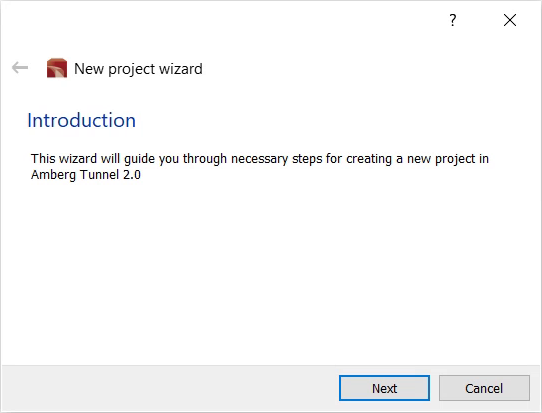

. Launch Amberg Tunnel
. Select menu:File[New project]
+
--
.Screenshot
[%collapsible]
====
image::01-file-new-project.png[]
====
--
. On the project wizard's *Introduction* screen, select btn:[Next]
+
--
.Screenshot
[%collapsible]
====

====
-- 
. On the *Basic project settings* screen, enter a project name and then select btn:[Next]
+
--
.Screenshot
[%collapsible]
====

====
-- 
. On the *Construction sites* screen, select btn:[Add]. Enter a site name and then select btn:[Next]
. On the *Headings of construction site...* screen, select btn:[Add tube heading]. Enter a name, then select btn:[OK] and then btn:[Next]
. On the *Customer information* screen, skip ahead by selecting btn:[Next]
. On the *File path settings* screen, select image:01-button-search.png[search button] 
. Browse to your Desktop (or location of your choice) and create a new folder.
+
--
NOTE: The folder will store all project-related files including automatically created subfolders and configuration files.
--
. Browse into the new folder and enter a project file name (e.g., Project1.at2prj) and then select btn:[Save]

.Video overview of *Creating a project*
video::A9NmKhPYtNI[youtube, width=640, height=360]