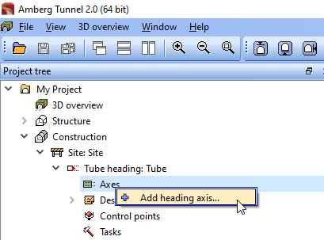

== Adding a horizontal alignment

NOTE: This exercise is a continuation from the previous lesson(s).

. Download and extract https://ambergtechnologies.com/fileadmin/user_upload/amberg-technologies/downloads/AmbergTunnel2/Software_and_DemoData/exhibition-heading.zip[this sample LandXML].
. In the Project tree, expand the *Construction* node and then the *Site* and *Tube* nodes
+
--
.Screenshot
[%collapsible]
====

====
--