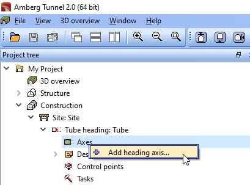

= Amberg Tunnel Exercises
:experimental:
:data-uri:
:toc: left
:sectnums:
:sectanchors:

== Creating a project

include::01-creating-a-project.adoc[]

== Adding a horizontal alignment

NOTE: This exercise is a continuation from the previous lesson(s).

. In the Project tree, expand the *Construction* node and then the *Site* and *Tube* nodes
+
--
.Screenshot
[%collapsible]
====

====
--
. 

== Adding a vertical alignment

== Creating a construction stage

== Adding theoretical profiles

== Adding theoretical sections