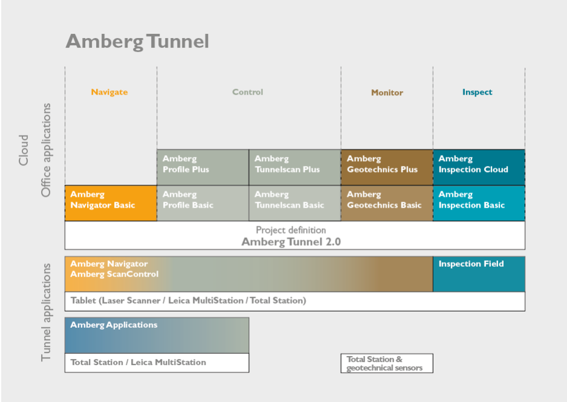

= Amberg Tunnel
User manual
:toc:
:toc-placement: left
:toclevels: 2
:icons: font

== Introduction

With **Amberg Tunnel 2.0 - Base**, you can define projects for Amberg Geotechnics, Amberg Navigator, Amberg Profile, Amberg Tunnelscan, and Amberg Inspection. The main project structure consists of sites, headings, axes, and construction stages.

[NOTE]
====
Please read this manual as well as the relevant Amberg Tunnel module manual(s).

.Module Manuals
- Amberg Profile
- Amberg Tunnelscan
- Amberg Geotechnics
- Amberg Inspection

====

=== Title 2

==== Title 3

===== Title 4

====== Title 5

This is the first line.

.Module Overview

[%collapsible]
====
This content is only revealed when the user clicks the block title.
This content is only revealed when the user clicks the block title.
This content is only revealed when the user clicks the block title.
This content is only revealed when the user clicks the block title.
====